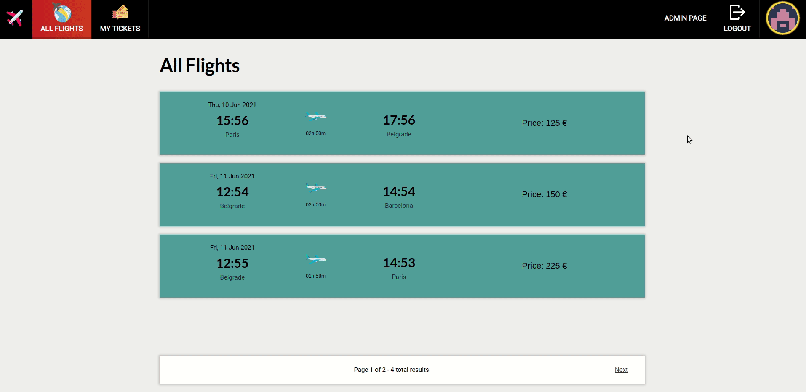

# Air tickets app

This is an air tickets app built with JavaScript/CSS on frontend and Node.js on backend.

The application is based on microservices architecture.

API gateway used for communication between client and services.

### App has three services:

-   [User service](#user-service)
-   [Flight service](#flight-service)
-   [Tickets service](#tickets-service)

# Demo-Preview

### User service


### Flight service



### Tickets service


# Table of contents

-   [Air tickets app](#air-tickets-app)
-   [Demo-Preview](#demo-preview)
-   [Table of contents](#table-of-contents)
-   [Installation](#installation)
-   [Technologies](#built-with)
-   [Features](#features)

# Installation

Clone repository:

```
git clone https://github.com/stefank-29/AirTicketsApp.git
```

Run project:

```
cd avio
npm install
npm start
cd ..

cd UserService
npm install
npm start
cd ..

cd AdminService
npm install
npm start
cd ..

cd TicketService
npm install
npm start

```

Open in browser at address:

```
http://127.0.0.1:8080/
```

### Built with:

-   Node.js
-   JavaScript
-   CSS

## Features:

-   ### User service

    -   Register account
    -   Email account verification
    -   Login
    -   Edit account info
    -   Forgotten password (get reset token on email)
    -   Change password
    -   Add credit card for payment
    -   User rank based on miles traveled

-   ### Flight service

    -   Search flights
    -   View all flights (departure/return)
    -   Admin dashboard
    -   List all flights
    -   List all airplanes
    -   Add new flight
    -   Add new airplane
    -   Canceling flight
        -   Money refund
        -   Email notification

-   ### Tickets service
    -   Purchase tickets
    -   Reservation of tickets during the purchase process
    -   Choosing credit card for payment
    -   Discount based on user rank
    -   View purchased tickets
